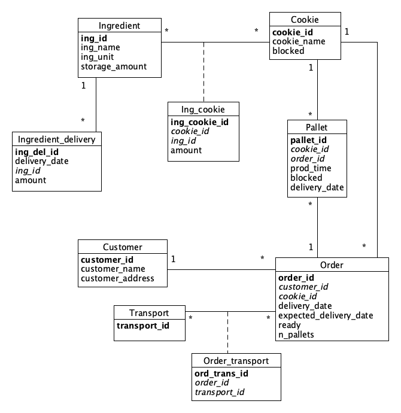

# EDAF75, project report

This is the report for

 + Anton Carlsson, `bas15aca`
 + Erik Leffler, `er1110le-s`
 + Desirée Ohlsson, `mas14doh`

We solved this project on our own, except for:

 + Input from Mattias Nordhal on our first version of our ER-model.


## ER-design

The model is in the file [`er-model.png`](er-model.png):

<center>
    
</center>


## Relations

The ER-model above gives the following relations (neither
[Markdown](https://docs.gitlab.com/ee/user/markdown.html)
nor [HTML5](https://en.wikipedia.org/wiki/HTML5) handles
underlining withtout resorting to
[CSS](https://en.wikipedia.org/wiki/Cascading_Style_Sheets),
so we use bold face for primary keys, italicized face for
foreign keys, and bold italicized face for attributes which
are both primary keys and foreign keys):

+ ingredient_deliveries(**ing_del_id**, _ing_id_, delivery_date, amount)
+ ingredients(**ing_id**, ing_name, ing_unit, storage_amount)
+ ing_cookies(**ing_cookie_id**, _cookie_id_, _ing_id_, amount)
+ cookies(**cookie_id**, cookie_name, blocked)
+ pallets(**pallet_id**, _cookie_id_, _order_id_, prod_time, blocked, delivery_date)
+ orders(**order_id**, _customer_id_, _cookie_id_, delivery_date, expected_delivery_date, ready, n_pallets)
+ customers(**customer_id**, customer_name, customer_address)
+ transports(**transport_id**)
+ order_transports(**ord_trans_id**, _order_id_, _transport_id_)


## Design choices

The `storage_amount` attribute of each ingredient in `ingredients` is automatically updated by triggers on both ingredient delivery and pallet creation (insertions into `ingredient_deliveries` and `pallets` respectively).

We found that there were various different ways to implement the blocking mechanism. We decided to go for the following: each pallet has a blocked attribute which applies only to that pallet, without side effects. Each cookie has a blocked attribute which will be used to set the blocked attribute of any created pallets. So if Tango cookies are blocked and a Tango pallet is created, then that pallet is automatically blocked, but if someone blocks a specific Almond Delight pallet, only that pallet is blocked without any side effects. This allows users to both block pallets in date ranges retroactively, and to block future pallets indefinetly.

All dates are kept as unixepoch values. Adhering to a specific date format seemed more complicated. Instead we convert between date formats and unixepoch values when interfacing the database. The API accepts any date format accepted by `STRFTIME(%s, <date>)`.


## Scripts to set up database

The script used to set up and populate the database:

 + [`create-schema.sql`](create-schema.sql) (defines the tables)

So, to create and initialize the database, one can run:

```shell
sqlite3 krusty.sqlite < create-schema.sql
```


## How to compile and run the program

The api uses port `8888`.

There are two ways to create the database if it doesn't exist. Either one can start the api by running
```shell
python app.py
```
and then initialize the schema by posting to the reset endpoint with
```shell
curl -X POST http://localhost:8888/reset 
```
Another approach is to first run the sql scripts as described in the previous section, "Scripts to set up database".

To test the api, run
```shell
python check-krusty.py
```
when the app is running.


